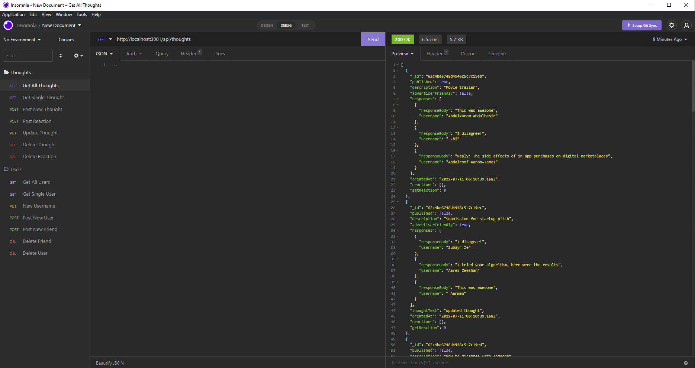

## Social Network API
  
  
 
  ## Table of Contents
  - [Description](#description)
  - [Installation](#nstallation)
  - [Contributors](#contributors)
  - [Usage](#usage)
  - [Tests](#tests)
  - [Questions](#questions)

  ## Description
  A social network API that uses MongoDB. This backend has many users that can have many friends. User's can have many thoughts and their friends (other users) can add reactions to their thougths.

  ## Installation
  npm i for all dependcies 

  ## Contributors
  Email me if you would like to contribute

  ## Usage
  Example of how a social network can work. Having users with many friends and thoughts that will all have their own unique IDs that link certain friends, users and thoughts and reactions together.

  ## Tests
  None 

  ## Questions
  - GitHub: RafaelH731
  - RepoLink: https://github.com/RafaelH731/social-network-api
  - Email: rafaelherrera731@gmail.com
  - https://youtu.be/ga-YoOFeU4I

  ## Screenshots
  - 
  

